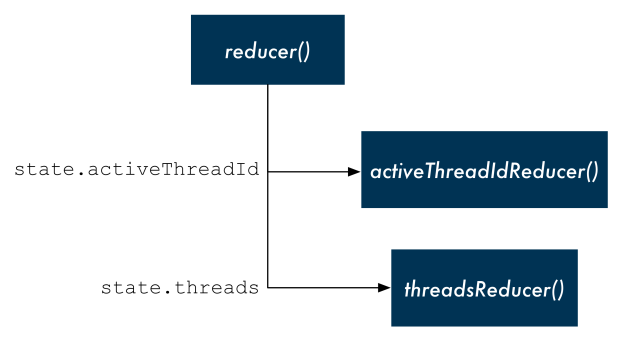

Redux’s key ideas  Redux是Flux的实现，应用于Redux的概念也适用于Flux
1.所有应用程序的数据都在一个称为state的单一数据结构被store持有
2.应用读取store中的state
3.在store之外，state从未发生过改变
4.view发出actions描述发生了什么
5.一个新的state是通过旧的state和一个被称为reducer函数的action生成
Reducers必须是纯函数

Action->Dispatcher->Store->View

在Redux中，store负责维护state和接受view中的操作。只有store才有权使用reducer:

createStore():提供两个方法
dispatch:我们如何向store发送操作
getState:读取当前的state值

redux管理复杂状态的优势：
1.所有的数据都在中央数据结构中
2.数据的变化是集中的
3.View发出的动作与state的突变分离
4.单向数据流可以很容易的跟踪系统的修改

分解reducer的功能
创建多个reducer, 每个reducer 管理不同的state.

ReduxAppBreakUp:分解reducer

